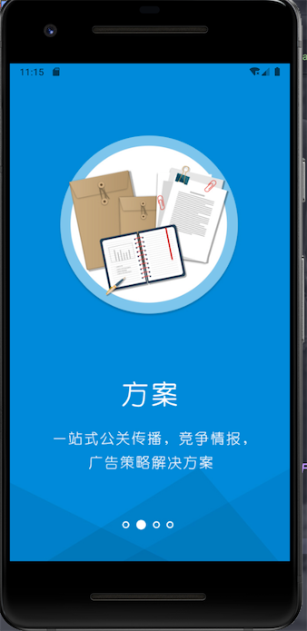
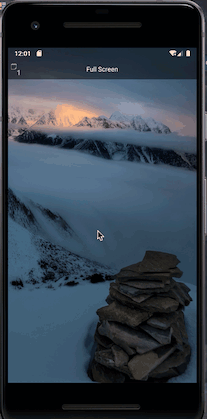

[toc]

# 项目说明

## APP 暂时空白

## fullscreen Activity中的全屏
* Blog 详细介绍 地址待补充
* APK: 直接运行查看效果
* <a href="dist/fullscreen-debug.apk" target="_bank">点击下载</a>

### Guide引导
> 全屏 显示StatusBar 和 隐藏NavigationBar StatusBar覆盖在图片上面

效果图如下： 

### 全屏图片预览

> 全屏预览 状态栏能够动态的显示和隐藏

效果图如下： 

### 刘海屏的全屏适配
